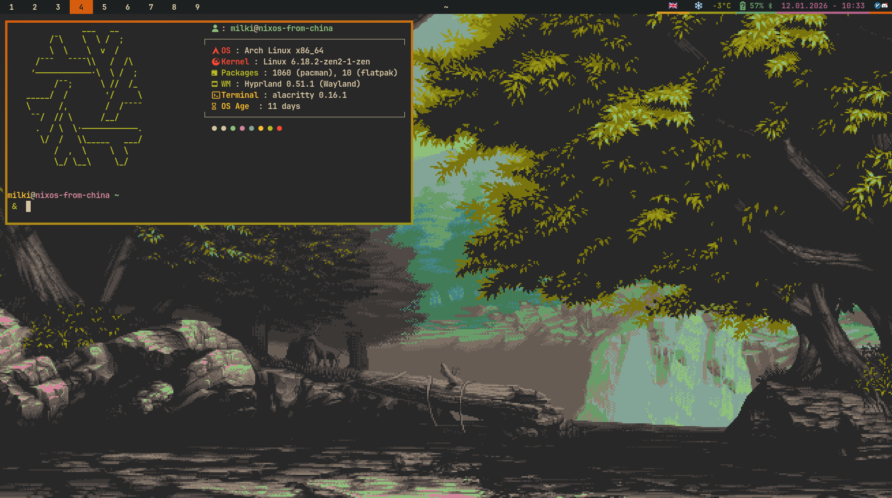

# My Gruvbox-Themed Arch Linux Dotfiles 🎨

A collection of my personal dotfiles for a consistent and beautiful Gruvbox-themed experience on Arch Linux using the Hyprland compositor.

This repository serves as a backup of my personal configurations.

**Original configuration:** [Andrey0189/arch-dotfiles](https://github.com/Andrey0189/arch-dotfiles)

## 🛠️ Changes

* Updated keybindings to be more ergonomic and intuitive.
* Added custom `fuzzel` scripts for a calculator, Bluetooth management, and more.
* Updated window rules (assigned specific workspaces for apps, added `noinitialfocus` for Steam).
* Modified Waybar (workspaces now display numbers instead of icons; changed time to 12-hour format).
* Added a large collection of wallpapers.
* Included a custom `fastfetch` configuration.
* Integrated NeoVim with the LazyVim framework and Gruvbox theme.

## 🚀 Installation

1. **Clone the repository:**
```bash
git clone https://github.com/Milkiway13/arch-dotfiles
cd arch-dotfiles

```


2. **Run the installation script:**
```bash
chmod +x install.sh
./install.sh

```


> **Note:** You must install the Tmux Plugin Manager (TPM) manually:
> ```bash
> mkdir -p ~/.config/tmux/plugins && git clone https://github.com/tmux-plugins/tpm ~/.config/tmux/plugins/tpm
> 
> ```
> 
> 

---

## 🖼️ Window Manager: Hyprland

[Hyprland](https://hyprland.org/) is a dynamic tiling Wayland compositor that provides modern aesthetics without sacrificing performance. ✨

### Keybindings ⌨️

| Keybinding | Description |
| --- | --- |
| `Super + Return` | Open terminal |
| `Super + Q` | Kill active window |
| `Super + Delete` | Exit Hyprland |
| `Super + E` | Open file manager (`nemo` or `ranger`) |
| `Super + T` | Toggle floating mode |
| `Super + F` | Toggle fullscreen |
| `Super + S` | Open application menu (`fuzzel`) |
| `Super + Shift + P` | Pin window |
| `Super + J` | Toggle split orientation |
| `Super + Shift + E` | Open emoji picker (`bemoji`) |
| `Super + V` | Open clipboard history (`cliphist`) |
| `Super + L` | Lock screen (`hyprlock`) |
| `Super + N` | Open notification center (`swaync`) |
| `Print` | Take a screenshot (`grimblast`) |
| `Super + B` | Open browser (`zen-browser` by default) |
| `Super + C` | Open calculator via `fuzzel` |
| `Super + X` | Open power menu via `fuzzel` |
| `Super + P` | Change audio output device via `fuzzel` |
| `Super + Shift + B` | Open Bluetooth manager (`bzmenu`) |
| `Super + Shift + T` | Open translator (`translate-shell`) |
| `Super + Arrow Keys` | Move focus |
| `Super + Shift + Arrows` | Swap window position |
| `Super + Ctrl + Arrows` | Resize window |
| `Super + [1-9]` | Switch to workspace |
| `Super + Shift + [1-9]` | Move window to workspace |
| `F1` | Mute audio |
| `F2` | Decrease volume |
| `F3` | Increase volume |
| `F4` | Mute microphone |
| `Super + ]` | Increase brightness |
| `Super + [` | Decrease brightness |
| `Super + Mouse` | Move/Resize window |

---

## 🐚 Shell

### Starship Prompt 🚀

* A minimal, blazing-fast, and infinitely customizable prompt for any shell.
* Displays username, hostname, and contextual information (e.g., Python virtual environment versions).

---

## 💻 Multiplexer: Tmux

[Tmux](https://github.com/tmux/tmux/wiki) is a terminal multiplexer that allows you to manage multiple terminal sessions easily.

### Keybindings ⌨️

| Keybinding | Description |
| --- | --- |
| `Alt + r` | Reload configuration |
| `Alt + s` | Choose session/window tree |
| `Alt + [1-9]` | Select window |
| `Alt + Arrow Keys` | Select pane |
| `Alt + Shift + Arrows` | Resize pane |
| `Alt + h` | Split window vertically |
| `Alt + v` | Split window horizontally |
| `Alt + Enter` | Create new window |
| `Alt + c` | Kill current pane |
| `Alt + q` | Kill current window |
| `Alt + d` | Detach from session |
| `Alt + Q` | Kill entire session |
| `Alt + /` | Search forward |
| `Alt + ?` | Search backward |

---

## 🖥️ Configured Applications

* 🚄 **[Alacritty](https://alacritty.org/):** A fast, GPU-accelerated terminal emulator using the Gruvbox theme and JetBrains Mono font.
* 📊 **[Waybar](https://github.com/Alexays/Waybar):** A highly customizable Wayland bar with Gruvbox-themed modules.
* 📨 **[Swaync](https://github.com/ErikReider/SwayNotificationCenter):** A simple notification daemon for Wayland, styled with Gruvbox colors.
* 🔒 **[Hyprlock](https://hyprland.org/docs/ecosystem/hyprlock/):** The official screen locker for Hyprland, featuring a blurred background and clock.
* 📁 **[Ranger](https://github.com/ranger/ranger):** A console-based file manager with VI keybindings and image preview support.
* 📖 **[Zathura](https://pwmt.org/projects/zathura/):** A highly customizable document viewer with VI-like keybindings and a Gruvbox theme.
* 🦇 **[Bat](https://github.com/sharkdp/bat):** A `cat` clone with syntax highlighting, using the `gruvbox-dark` theme.
* 🏎️ **[Fastfetch](https://github.com/fastfetch-cli/fastfetch):** A system information utility that displays your OS, WM, Kernel, and hardware specs.
* 📝 **[NeoVim](https://github.com/neovim/neovim):** A powerful CLI text editor with [LazyVim](https://github.com/LazyVim/LazyVim) and a Gruvbox theme.

