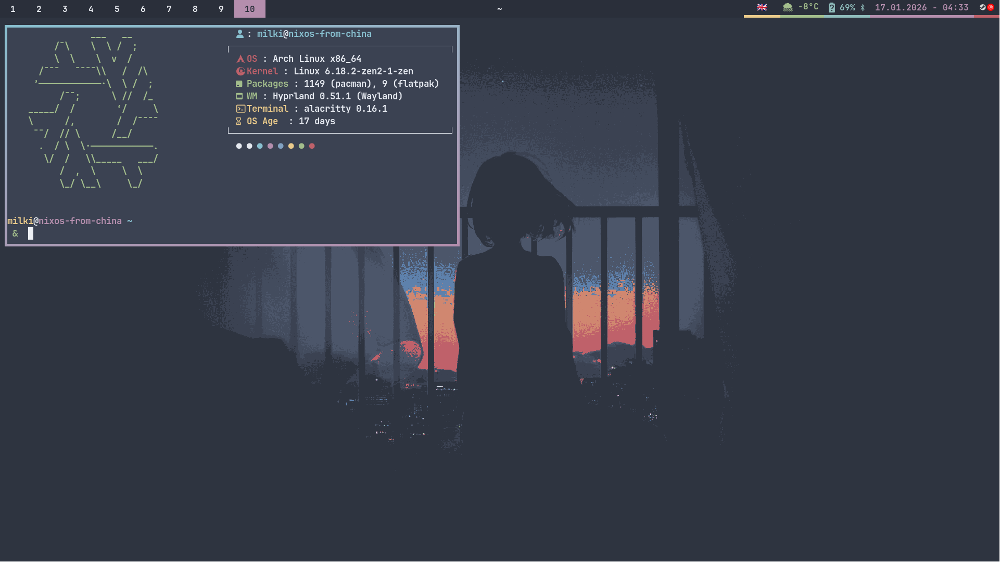

# My Themed Arch Linux Dotfiles 🎨

A collection of my personal dotfiles for a consistent and beautiful themed experience on Arch Linux using the Hyprland compositor.

**Original configuration:** [Andrey0189/arch-dotfiles](https://github.com/Andrey0189/arch-dotfiles)

## 🚀 Installation

```bash
git clone https://github.com/Milkiway13/arch-dotfiles
cd arch-dotfiles
chmod +x install.sh
./install.sh
```

---
## 🖼️ Window Manager: Hyprland

[Hyprland](https://hyprland.org/) is a dynamic tiling Wayland compositor that provides modern aesthetics without sacrificing performance. ✨

### Keybindings ⌨️

| Keybinding | Description |
| --- | --- |
| `Super + Return` | Open terminal |
| `Super + Q` | Kill active window |
| `Super + Delete` | Exit Hyprland |
| `Super + E` | Open file manager (`nemo` or `ranger`) |
| `Super + T` | Toggle floating mode |
| `Super + F` | Toggle fullscreen |
| `Super + S` | Open application menu (`fuzzel`) |
| `Super + Shift + P` | Pin window |
| `Super + J` | Toggle split orientation |
| `Super + Shift + E` | Open emoji picker (`bemoji`) |
| `Super + V` | Open clipboard history (`cliphist`) |
| `Super + L` | Lock screen (`hyprlock`) |
| `Super + N` | Open notification center (`swaync`) |
| `Print` | Take a screenshot (`grimblast`) |
| `Super + B` | Open browser (`zen-browser` by default) |
| `Super + C` | Open calculator via `fuzzel` |
| `Super + X` | Open power menu via `fuzzel` |
| `Super + P` | Change audio output device via `fuzzel` |
| `Super + I` | Change theme via `fuzzel` |
| `Super + Shift + B` | Open Bluetooth manager (`bzmenu`) |
| `Super + Shift + T` | Open translator (`translate-shell`) |
| `Super + Arrow Keys` | Move focus |
| `Super + Shift + Arrows` | Swap window position |
| `Super + Ctrl + Arrows` | Resize window |
| `Super + [1-9]` | Switch to workspace |
| `Super + Shift + [1-9]` | Move window to workspace |
| `F1` | Mute audio |
| `F2` | Decrease volume |
| `F3` | Increase volume |
| `F4` | Mute microphone |
| `Super + ]` | Increase brightness |
| `Super + [` | Decrease brightness |
| `Super + Mouse` | Move/Resize window |

---

## 🐚 Shell

### Starship Prompt 🚀

* A minimal, blazing-fast, and infinitely customizable prompt for any shell.
* Displays username, hostname, and contextual information (e.g., Python virtual environment versions).


